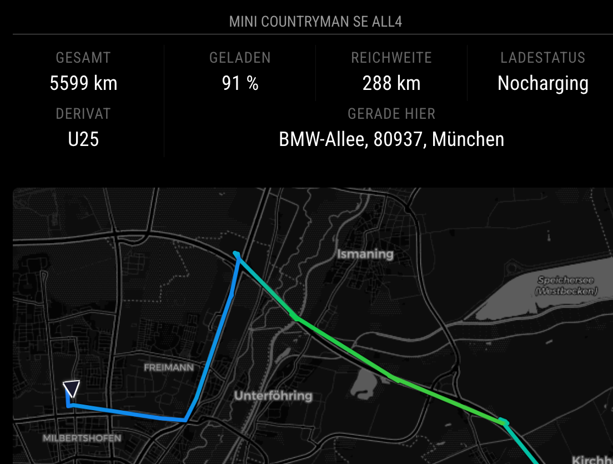

# MMM-BMWCarData

A [MagicMirror²](https://magicmirror.builders/) module pack that connects to the **BMW CarData** (and **MINI CarData**) live MQTT stream and displays vehicle in two front-end modules as text or in a map:

| Module | What it shows |
|---|---|
| **MMM-BMWCarDataInfo** | Configurable grid of any CarData topic values — battery/SoC, fuel, tire pressures, range, mileage, temperatures, status fields, … |
| **MMM-BMWCarDataMap** | Live Leaflet map — 24 h GPS track (Kalman-smoothed, speed-coloured), current position + heading arrow, charging-stop and parking-stop markers with details |

## Screenshots



## Features

### Info panel (MMM-BMWCarDataInfo)
- **Live MQTT stream** — no polling, instant updates for every value your car sends
- **Any CarData descriptor** — configure any of the 200+ descriptor paths; units (bar, °C, km/h, %, km, kW, …) are auto-detected from the path name
- **Topic discovery** — every received descriptor path is recorded in `data/discovered-topics-{vin}.json` with its last value, type, and receive count — the starting point for building your `topics` list
- **Conditional display** — show topics only when a condition is met (e.g. charging info only while charging) using [JsonLogic](https://jsonlogic.com/) expressions in `showWhen`
- **Translations** — enum and boolean values are looked up in `translations/*.json` by key `topic.<full-path>.<VALUE>`; override individual strings per-instance via `customTranslations` in your config
- **Flexible grid** — 1–6 display columns, per-topic `span` for wide cells (e.g. address across the full width)
- **Multi-car support** — add the module more than once with different VINs of the same or different BMW accounts

### Map (MMM-BMWCarDataMap)
- **GPS track** — up to configurable number of hours of history; smoothed tracks for efficient rendering
- **Speed-coloured hotline** — configurable gradient, e.g. blue (city) → green (country road) → orange → red (Autobahn)
- **Charging stops** — icon on the map, popup with arrival/departure time, initial→final SoC, and kWh charged
- **Parking stops** — icon on the map, popup with arrival/departure time and reverse-geocoded address
- **Multi-car map** — add the module more than once - one map can show the position and track of one or more cars

### Shared
- **BMW and MINI** support (see Requirements below for details)
- **Reverse geocoding** via Nominatim (OSM) — no API key required; throttled and LRU-cached
- **Tile proxy** — map tiles fetched server-side, avoiding Electron/CSP restrictions; supports CartoDB Dark Matter, CartoDB Positron, and OpenStreetMap out of the box
- **OAuth2 device-code flow with PKCE** — one `node tools/login.js` per BMW account; tokens refresh automatically every ~1 h
- **State persistence** — position, tracks and topic values survive a MagicMirror restart

## Requirements

- BMW/MINI ConnectedDrive account with **CarData** enabled (EU + selected regions; see [docs/BMW-CARDATA-SETUP.md](docs/BMW-CARDATA-SETUP.md))
- MagicMirror² v2.20+
- Node.js ≥ 18

## Installation

Clone this repository in your modules folder, and install dependencies:

```bash
cd ~/MagicMirror/modules
git clone https://github.com/hamsil/MMM-BMWCarData.git
cd MMM-BMWCarData
npm install
```

`npm install` automatically copies Leaflet assets into `MMM-BMWCarDataMap/vendor/`.

## Update

```bash
cd ~/MagicMirror/modules/MMM-BMWCarData
git pull
npm install
```

## First-time BMW/MINI setup

See **[docs/BMW-CARDATA-SETUP.md](docs/BMW-CARDATA-SETUP.md)** for the full step-by-step guide.

**Quick summary:**
1. Sign in at BMW / MINI Car Data Portal → create a CarData Client → copy the `Client ID`
2. In the portal, select all the data points you want to stream (recommended list in the setup doc)
3. Run: `node tools/login.js` — follow the on-screen prompt
4. Add both modules to `config/config.js` (see below)
5. Restart MagicMirror

## Configuration

### General Configuration

Configure `locale` in your root config, e.g. `locale: "de-DE"`. It is used by this module for
- reverse geocoding
- map tiles *(sometimes towns are named in English nevertheless...)*

Translations are only provided for German and English (see `/translations`). English is the fallback for unknown languages. 
 
### Module Configuration

The minimal configuration of both modules for one vehicle is

```js
{
  module:   "MMM-BMWCarData/MMM-BMWCarDataInfo",
  position: "top_center",
  config: {
    clientId: "xxxxxxxx-xxxx-xxxx-xxxx-xxxxxxxxxxxx",
    vin:      "WMWxxxxxxxxxxxxxx",
    geocoder: { contact: "you@example.com" },
    columns: 3, // default is 4, but 3 makes more sense for the selected four topics
    topics: [
      { path: "vehicle.vehicle.travelledDistance", label: "gesamt" },
      { path: "vehicle.drivetrain.batteryManagement.header", label: "geladen" },
      { path: "vehicle.drivetrain.electricEngine.kombiRemainingElectricRange", label: "Reichweite" },
      { path: "vehicle.location.address", label: "gerade hier", span: 3 }
    ]
  }
}
```

```js
{
  module:   "MMM-BMWCarData/MMM-BMWCarDataMap",
  position: "top_center",
  config: {
    width: "600px", // optional, but default 100% is too narrow in this position
  }
}
```

The configuration of my own MagicMirror² with a MINI and a BMW is almost identical:

- `MMM-BMWCarDataInfo`
  - defined twice for each `vin`
  - same `clientId` in both instances as I use the same ConnectedDrive account for the BMW and the MINI
  - `header` with the description of the car
- `MMM-BMWCarDataMap`
  - exactly as above (the default if `vins`is not defined is to display the positions/tracks of all `vin`s of all Info modules, which is exactly what I want)


### Topics List

Each entry is either a plain topic path **or** an object with optional `label`, `format`, and `span`:

```js
{
  topics: [
    // Plain path — label and format both auto-detected
    "vehicle.vehicle.travelledDistance",

    // Custom label, auto-detected format
    { path: "vehicle.drivetrain.batteryManagement.header", label: "Battery" },

    // Custom label + explicit format override
    { path: "vehicle.chassis.axle.row1.wheel.left.tire.pressure",
      label: "Tire FL", format: "{v/100:.1f} bar" },

    // span: occupy 2 columns (useful for long text like addresses)
    { path: "vehicle.location.address", label: "Location", span: 2 },

    // showWhen: only display while charging
    { path: "vehicle.drivetrain.electricEngine.charging.power",
      label: "Charging",
      showWhen: { "==": [{ "var": "vehicle.drivetrain.electricEngine.charging.status" }, "CHARGINGACTIVE"] } },
  ]
}
```

#### Conditional display (`showWhen`)

Add `showWhen` to any topic entry to show it only when a vehicle condition is met.
Variables are **full BMW topic paths** — the same paths you use in the `topics` list.
The syntax follows [JsonLogic](https://jsonlogic.com/).

```js
// Show only while charging
showWhen: { "==": [{ "var": "vehicle.drivetrain.electricEngine.charging.status" }, "CHARGINGACTIVE"] }

// Show only while not moving
showWhen: { "==": [{ "var": "vehicle.isMoving" }, false] }

// Show while charging OR while stopped (OR)
showWhen: { "or": [
  { "==": [{ "var": "vehicle.drivetrain.electricEngine.charging.status" }, "CHARGINGACTIVE"] },
  { "==": [{ "var": "vehicle.isMoving" }, false] },
] }
```

**Operator quick reference:**

| Operator | Meaning |
|---|---|
| `"=="` / `"!="` | equal / not equal |
| `"<"` / `"<="` | less than / less than or equal |
| `">"` / `">="` | greater than / greater than or equal |
| `"!"` | logical NOT |
| `"and"` | all conditions must be true |
| `"or"` | at least one condition must be true |

> If the referenced topic path has never been received from MQTT, the condition
> evaluates to `false` and the topic is hidden until data arrives.

#### Auto-formatting

The module infers format from the path and the values — no formatter needed per topic:

| Path contains | Displayed as |
|---|---|
| `pressure` | bar (raw kPa ÷ 100) |
| `temperature` | °C |
| `speed` | km/h |
| `Range`, `Distance`, `Mileage`, `travelledDistance` | km |
| `stateOfCharge`, `header`, `hvSoc` | % |
| `charging.power` | kW |
| `maxEnergy` | kWh |
| `consumption`, `recuperation` | kWh/100 km |
| `litres`, `liters` | l |

| Value contains | Displayed as |
|---|---|
| `true`, `false`  | Translation lookup via key `topic.<full-path>.true` / `topic.<full-path>.false` in the active locale (falls back to English, then raw "Yes" / "No"). See `MMM-BMWCarDataInfo/translations`  |
| only uppercase characters | Translation lookup via key `topic.<full-path>.<VALUE>` in the active locale (falls back to English, then raw value). See `MMM-BMWCarDataInfo/translations` |
| Timestamp string | Local date + time |

#### Format Override

When the auto-detected format is wrong (e.g. your car sends pressure in a different unit), override with a `format` string:

```
{v}              raw value, auto precision
{v:.1f}          raw value, 1 decimal place
{v/100}          raw value ÷ 100, auto precision
{v/100:.1f} bar  raw value ÷ 100, 1 decimal, appended " bar"
{v*3.6:.0f} km/h raw value × 3.6, no decimals
```

- `v` is the raw MQTT value; standard arithmetic (`+ - * /`) is supported
- `:.Nf` sets decimal places (`:.0f` = integer, `:.1f` = 1 decimal, …)
- Text outside `{…}` is appended as-is (unit, prefix, suffix)

#### Topic Discovery

Several files in `data/` help you understand what your car provides:

| File | When created | What it contains |
|---|---|---|
| `discovered-topics-{vin}.json` | Grows at runtime | Every MQTT descriptor path your car has ever sent — last value, type, timestamp, and receive count. The live source for your `topics:` list. |
| `locations-{vin}.log` | When `debugLocations: true` | Every raw GPS coordinate received from MQTT, one per line: `wallMs field gpsTsMs value`. Deleted at midnight (or on startup if from a previous day). |
| `basic-data-{vin}.json` | Once at startup | Static vehicle metadata from the BMW CarData REST API (brand, model, model year, colour, …). Attributes become `basicdata.<attr>` topics. |
| `capabilities-{vin}.json` | Once at startup | Vehicle capability flags from the BMW CarData REST API — which features the car supports. Stored for reference; not used by the module itself. *Well, that's the theory, in practice I always get error 403 when calling the CarData API for capabilities and thus a warning in the log :-(* |

To force a re-fetch of the REST API files, delete them and restart MagicMirror².

#### Synthetic Topics

Some values are not raw MQTT topics but are computed or fetched by the module and injected under a stable synthetic path so they can be added to `topics` like any other entry:

| Synthetic path | Value |
|---|---|
| `vehicle.location.address` | Reverse-geocoded street address of the current position (if `geocoder: true`, using Nominatim ) |
| `basicdata.<field>` | Static vehicle metadata from the BMW CarData REST API — fetched once per VIN and cached in `data/basic-data-{vin}.json`. Browse this file after first run to see all available fields, e.g. `basicdata.brand`, `basicdata.modelName`, `basicdata.series`, `basicdata.bodyType`, `basicdata.driveTrain`. |
| `image` | Vehicle image from the BMW CarData REST API — fetched once and cached as `data/image-{vin}.jpg`. Rendered as a scaled image that fills the cell width (use `span` to make it wider). *Again this is the theory, in practice I always get error 403 when calling the CarData API for the image and thus a warning in the log :-(* |

Examples:
```js
{
  topics: [
    { path: "basicdata.brand",      label: "Brand" },
    { path: "basicdata.modelName",  label: "Model" },
    { path: "basicdata.series",     label: "Series" },
    { path: "basicdata.driveTrain", label: "Drive" },
    { path: "image", span: 2 },  // if it would work
  ]
}
```

The REST API calls are made **once at startup** if the cached files do not yet exist. They use the same `access_token` from the device-code login — no additional credentials are needed. See the topic-discovery table above for all three auto-fetched files and how to force a refresh.

> **Timestamps** — all timestamps in the data files (`discovered-topics-{vin}.json`,
> `state-{vin}.json`) are stored in **UTC** (ISO 8601, `Z` suffix).
> E.g. they will appear 1–2 hours behind local time in Germany (CEST/BST/…).

### Columns

Number of columns in the grid of the Info module:

```js
{
  config: {
    columns: 3,   // 1 | 2 | 3 | 4 (default) | 5 | 6
    topics: [ … ]
  }
}
```

### Multi-car Setup

Run one Info module per VIN — each gets its own MQTT connection, `data/state-{vin}.json`, and `data/discovered-topics-{vin}.json`. Tokens are per BMW account and shared: a single `data/tokens-{clientId}.json` covers all VINs on the same account.

You can run one or more Map modules that show the position and track for one or several VINs. Use `vins` to link a Map module to the VINs to display. If you do not set 'vins', the Map module shows all configured VINs.

```js
{ modules :
  [
    // Vehicle 1
    { module: "MMM-BMWCarData/MMM-BMWCarDataInfo", config: { vin: "WMW111" } },
    // Vehicle 2
    { module: "MMM-BMWCarData/MMM-BMWCarDataInfo", config: { vin: "WBA222" } },

    // One map showing both vehicles
    { module: "MMM-BMWCarData/MMM-BMWCarDataMap", config: {} },

    // Or a dedicated map for vehicle 2 only
    { module: "MMM-BMWCarData/MMM-BMWCarDataMap", config: { vins: ["WBA222"] } },
  ]
}
```

Run `node tools/login.js` **once per BMW account** — tokens are per account, not per vehicle. 

---

### All options — MMM-BMWCarDataInfo

| Option | Default | Description |
|---|---|---|
| `clientId` | `""` | **Required.** BMW CarData OAuth Client ID (portal) |
| `vin` | `""` | **Required.** Vehicle VIN |
| `topics` | `null` | **Highly recommended.** Array of topic paths to display. Each entry: plain path string, or `{ path, label?, format?, span?, showWhen? }` (see above). If omitted the module shows a "No topics configured" message. |
| `columns` | `4` | Number of display columns (1–6) |
| `customTranslations` | `{}` | Override any translation key without editing the translation files. Keys follow the same format as `translations/en.json`. Example: `{ "topic.vehicle.isMoving.true": "Moving", "topic.vehicle.isMoving.false": "Parked" }` |
| `debugLocations` | `false` | Set to `true` to write `data/locations-{vin}.log` — a raw GPS coordinate log useful for debugging the track. The file is deleted at midnight (detected on first location arrival after midnight) and on startup if it is from a previous day. |
| `parkingMinMinutes` | `10` | Min stationary minutes to register a parking stop |
| `mqttHost` | `customer.streaming-cardata.bmwgroup.com` |  MQTT host (from portal streaming credentials) |
| `mqttPort` | `9000` |  MQTT port (from portal streaming credentials) |
| `geocoder.enabled` | `true` | Enable Nominatim reverse geocoding |
| `geocoder.url` | `"https://nominatim.openstreetmap.org/reverse"` | Override with self-hosted instance |
| `geocoder.contact` | `""` | Your email — **required** when `geocoder.enabled` is true (Nominatim policy). Geocoder is automatically disabled with a warning if omitted. |
| `geocoder.minIntervalSec` | `60` | Min seconds between geocoding requests |
| `geocoder.minMoveMeters` | `100` | Min distance moved before re-geocoding |

### All options — MMM-BMWCarDataMap

| Option | Default | Description |
|---|---|---|
| `vins` | `[]` | List of VINs this map shows, e.g. `["WMW111", "WBA222"]`. Empty = show all connected cars in one map. |
| `height` | `"480px"` | CSS height of the map |
| `width` | `"100%"` | CSS width — leave at `100%` to fill the region column (this is too narrow for the center column, so here you better set something like `600px`) |
| `trackHours` | `24` | Hours of GPS track to display. `0` → no track, map stays centred on current position at `defaultZoom`. `>0` → show the most recent N hours, auto-fitted to fill the map. |
| `trackColor` | `linear-gradient(to right, #1a6bff 0%, #00bbcc 20%, #00cc55 40%, #ffcc00 64%, #ff5500 80%, #dd0000 100%)` | Track colour — a single CSS colour (`"steelblue"`, `"#ff0000"`) **or** a `linear-gradient` string whose percentage stops map to speed: 0 % = 0 km/h, 100 % = 250 km/h. Default (admittedly, quite subjective) is a gradient from blue (city up to 50 km/h) → green (Landstraße, up to 100 km/h) → yellow (Autobahn slowly, up to 160 km/h) → orange (Autobahn normal, up to 200 km/h) → red (fun on the Autobahn loving my BMW, more than 200 km/h). |
| `defaultCenter` | `[51, 10]` | `[lat, lon]` shown before the first GPS fix |
| `defaultZoom` | `20` | Zoom level used when no track is displayed (`trackHours: 0` or no data yet) |
| `tileUrl` | CartoDB Dark Matter (via proxy, see below) | Leaflet tile URL template |
| `tileApiKey` | `""` | Optional API key appended as `?api_key=…` |
| `tileAttribution` | `"&copy; <a href='https://openstreetmap.org'>OSM</a> &copy; <a href='https://carto.com'>CARTO</a>"` | Attribution HTML (keep per licence) |
| `tileFilter` | `"brightness(2.5) contrast(1.2)"` | CSS filter applied to tile pane only |
| `debugRaw` | `false` | Show faint unsmoothed track overlay |

## Map tile options

Tiles are fetched server-side and cached 24 h — no CSP/Electron issues.

| Provider | `tileUrl` |
|---|---|
| **CartoDB Dark Matter** *(default)* | `/MMM-BMWCarDataInfo/tile/carto-dark/{z}/{x}/{y}.png` |
| CartoDB Positron | `/MMM-BMWCarDataInfo/tile/carto-light/{z}/{x}/{y}.png` |
| OpenStreetMap | `/MMM-BMWCarDataInfo/tile/osm/{z}/{x}/{y}.png` |

The default (CartoDB Dark Matter with `brightness(2.5) contrast(1.2)`) works well for both regular screens and **smart mirrors** (one-way glass): dark pixels are transparent through the glass, light roads float visibly.

To switch to a lighter style, set `tileFilter: ""` and pick CartoDB Positron or OpenStreetMap.

To add a custom provider, add an entry to `PROVIDERS` in
`MMM-BMWCarDataInfo/node_helper.js` and use its key in `tileUrl`.

## Diagnostics

**Check the MagicMirror log** for entries prefixed `[BMW …]` — connection status, token refresh, geocoding errors, and MQTT messages are all logged there.

**Discover what your car sends**: after the first MQTT message arrives, `data/discovered-topics-{vin}.json` lists every descriptor path with its last value, type, and receive count. Use it to build your `topics:` list.

**Debug the MQTT connection** with an external tool such as [MQTT Explorer](https://mqtt-explorer.com/). Connection parameters (found in `data/tokens-{clientId}.json`):

| Field | Value |
|---|---|
| Host / Port | From the BMW CarData portal streaming credentials |
| Username | `gcid` field in the token file |
| Password | `idToken` field (rotates ~1 h — re-read after an automatic refresh) |
| TLS | On |
| Topic | `{gcid}/{vin}` — or `{gcid}/#` to see all topics |

> BMW allows only **one concurrent MQTT connection per GCID**. Stop MagicMirror before connecting an external tool.

## Testing the map without driving

You can inject a pre-recorded GPS track into a running MagicMirror to test the map display — speed-coloured hotline, Catmull-Rom spline, zoom behaviour — without moving the car and without touching the MQTT connection.

### Quick start — pre-built example route

A ready-to-use route (München Hauptbahnhof → Nürnberg Hauptbahnhof, ~170 km) is included at `tools/example/munich-nuremberg.json`.

The node_helper exposes two HTTP endpoints so injection works with plain `fetch()` from the browser dev console — no MagicMirror module API required.

#### Authentication

The `POST /inject-track` endpoint requires a **Bearer token** to prevent unauthorised track injection from the local network.

The token is generated automatically on first start and saved to `data/inject-token.json` (permissions `0600`). It is also printed to the MagicMirror console log on every start:

```
[BMW] Inject-track bearer token: <your-token-here>
```

Copy the token from the log and use it in every inject request (see examples below). The token persists across restarts — you only need to copy it once.

> **Security note:** Anyone who can read the MagicMirror log or `data/inject-token.json` can inject arbitrary GPS tracks. The endpoint is write-only (it cannot read your real location data, and live MQTT streaming is unaffected), but on a shared or internet-exposed system you may want to delete `data/inject-token.json` and restart to rotate the token.

Reference the example file by name — the server reads it, so the POST payload stays tiny:

```js
const TOKEN = '<your-token-here>';  // from MagicMirror console log

// Inject
await fetch('/MMM-BMWCarDataInfo/inject-track', {
  method: 'POST',
  headers: {
    'Content-Type': 'application/json',
    'Authorization': `Bearer ${TOKEN}`,
  },
  body: JSON.stringify({ exampleFile: 'munich-nuremberg.json' }),
}).then(r => r.json());
// → { ok: true, points: 2139 }

// Clear
await fetch('/MMM-BMWCarDataInfo/inject-track', {
  method: 'POST',
  headers: {
    'Content-Type': 'application/json',
    'Authorization': `Bearer ${TOKEN}`,
  },
  body: JSON.stringify({ track: [] }),
}).then(r => r.json());
```

Or with curl:

```bash
TOKEN="<your-token-here>"   # from MagicMirror console log

# Inject
curl -s -X POST http://localhost:8080/MMM-BMWCarDataInfo/inject-track \
     -H 'Content-Type: application/json' \
     -H "Authorization: Bearer $TOKEN" \
     -d '{"exampleFile":"munich-nuremberg.json"}'

# Clear
curl -s -X POST http://localhost:8080/MMM-BMWCarDataInfo/inject-track \
     -H 'Content-Type: application/json' \
     -H "Authorization: Bearer $TOKEN" \
     -d '{"track":[]}'
```

MQTT stays connected throughout. Subsequent live GPS points from the car simply append to the injected track.

### Generate a custom route

instead of using the ready-to-use route you can easily create your own route between two addresses for testing:

```bash
node tools/gen-track.js \
  --from "Augsburg Hauptbahnhof" \
  --to   "München Hauptbahnhof, Bayern" \
  --output tools/example/augsburg-munich.json
```

The output file contains `{ meta, track }` where each track point has `{ lat, lon, speed, heading, dt }`. The `dt` field is the elapsed seconds since the previous point (0 on the first), derived from the actual OSRM segment distance and local speed — so city segments are tightly spaced and highway segments are widely spaced, matching real GPS behaviour.

Timestamps are **not** stored in the file, which means it never expires and can be committed to version control. The `INJECT_TEST_TRACK` handler assigns fresh `t` values at inject time, placing the trip as ending at the current moment.

## License

MIT — see [LICENSE](LICENSE).
